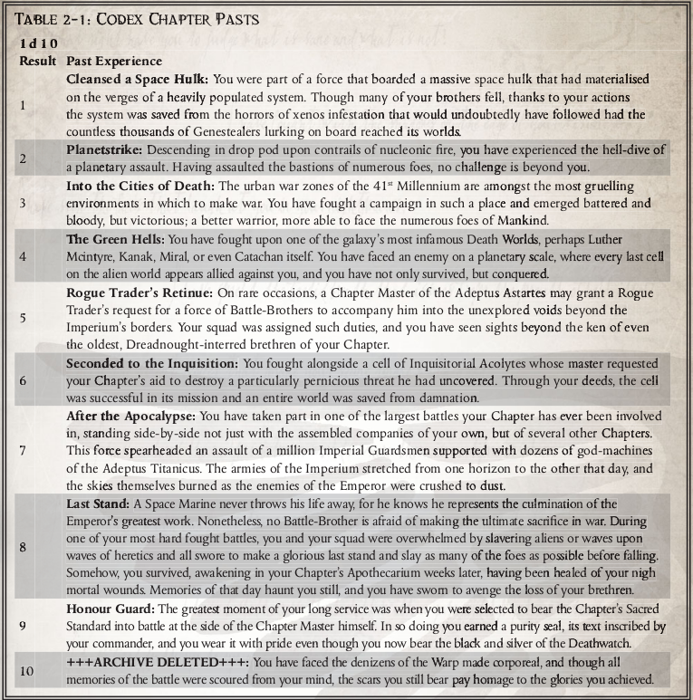

# House Rules

A collection of suggested house rules to make play faster and more fun!

## Characteristics Array Method
Take the following array and add 5 points. You may not increase any number above 20 in this manner:  
`2, 6, 8, 10, 11, 12, 14, 16, 18`  
The resulting figures may be added to your characteristics in any order you wish.

## Chapter Selection
One chapter from each founding only. Obviously, an unlimited number of choices from unknown foundings is allowable, though only one from each chapter. No more than 2 characters that are successors of the same chapter, or are themselves members of the parent chapter.

## Gear Swapping
Where it makes sence for the character, players are allowed to swap out starting wargear (AKA standard issue wargear) with others of simular power level. Of course the GM has final say on what is or isn't an acceptable swap.

#### Power Armour Swap Example
1. You may always choose to take MK7 armour or roll on the table in Rites of Battle.
2. If you are a tactical marine with 'Tactical Expertise' and a Fellowship and Willpower of at least 40. You may choose to take MK8 armour.
3. If you are a tactical marine with bolter mastery and an agility and perception of at least 40 you may attempt to get MK6 armour by rolling a 6+ on a d10. Otherwise, you start with MK7.
4. If you are an assault marine you may attempt to start with MK6 armour by rolling a 6+ on d10. Otherwise you start with MK7
5. If your chapter is Raven Guard or a Raven Guard successor and you fufill condition 3 or 4 above you may choose to start with mk6 armour.
6. If your chapter is Raven Guard or a Raven Guard successor and you don't fufill either condition 3 or 4 above you may attempt to start with MK6 armour by rolling a 6+ on a d10

#### Other Exceptable Examples
 * Carcharodon Assault Marine with a chain axe instead of a chainsword.
 * Salamanders Devastator with a heavy flamer instead of a heavy bolter.

#### Unacceptable Examples
 * Salamanders Devastator with a multi-melta instead of a heavy bolter.

## Infinite Reloads
As an experienced and elite team, you are always considered to have brought enough amunition to get the job done. Unless the secnario dictates otherwise, your character always has another reload for all basic and pistol weapons. Only heavy weapons and grenades require the player to track reloads.

## Storm Weapons can Suppress
Storm Weapons can be used for suppressing fire, following all the rules for suppressing fire that full auto weapons do. A hit using a storm weapon with suppressing fire, not on full auto, does not count as two hits.

## Using Astartes/Mortal weapons
An astartes can spend a half action, ripping off trigger guards etc from a mortal weapon to make it usable. Doing so will make the weapon standard quality, unless it's already poor quality. Mortal weapons used by an astartes count as being inacurate. Aditionally a natural 100 rolled to use a mortal weapon by an astartes will destroy the wargear.

A mortal can fire an astartes weapon without modification to the weapon. Astartes weapons used by an mortal count as being inacurate. Aditionally a natural 100 rolled to use a mortal weapon by an astartes will inflict a critical wound to a random location of the user. Roll on the impact critical chart against the given location 1d5.

## Hit Location Chart
The hit location rules that came with the origional Dark Heresy 2 Beta (which was sinse scrapped) is faster and  easier to remember. In this system you take the units dice of your to-hit roll and compaire them to the bellow chart.
1=Head, 2=Left Arm, 3=Right Arm, 4-6=Chest, 7-8=Left Leg, 9-0=Right Leg.

## Errata
The [Deathwatch Errata](DeathwatchErrata.pdf) fix a lot of issues and speed up play. They are highly recomended!

## Conflicting or Missing Rules
Here and there there are conflicting rules when it comes to certain topics within the Deathwatch rulebooks. The following is a list of rulings to deal with some frequently asked questions:
#### Astarties Past Deeds for Custom Made Chapters
Astartes from a chapter made using the custom chapter creation rules presented in Rites of Battle may have past selected from the following:

`Honor The Chapter pg100`

#### Squad Modes for Codex Chapters
Using the your chapter's background and past as a guide you may choose your chapters squad mode attack and defensive pattern from the tables in Honor the Chapter pg33.

#### Duplicates of the same Chapter
The general rule of thumb here is to take the rules from the earlier book. For Exaple the Flesh Tearers are presented in both Rites of Battle and Honour the Chapter. Take the rules in Rights of Battle. Novamarines have the exact same problem, and the exact same solution.

#### First Founding Chapters with less Squad Modes/Solo Modes/Psychic Powers that the Storm Wardens
I am aware of this issue, but I have never heard a complaint about it. If and when a complaint does arrise I will try to come to a simple solution and document it here.
