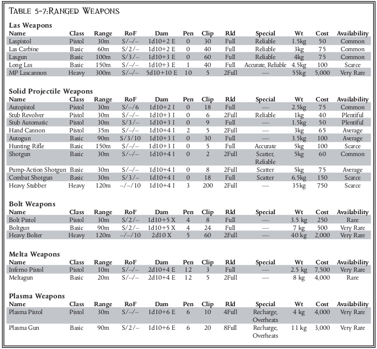
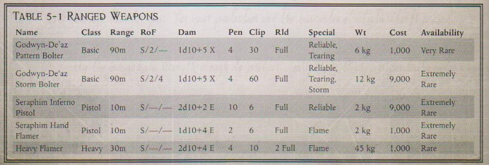

# Wargear

## New Weapon Special Qualities

### Sanctified

## Astartes Wargear

### Chain Axe

### Frost Blade

## Attached Operatives Wargear

### Ranged Weapons

##### Las Weapon Variable Settings
The standard basic or pistol las weapon has a variable setting option, allowing it to fire higher-powered bursts. It may be set to overcharge mode, dealing +1 damage, but using two shots worth of ammunition per shot fired. Further, the weapon may be set to overload mode, dealing +2 damage and gaining +2 penetration. In this case, it uses four shots of ammunition per shot fired, loses Reliable, and gains Unreliable.

#### Godwyn-De'az Bolt Pistol
|           Name           |  Class | Range |  RoF  |    Dam  | Pen | Clip |  Rld |      Special      |  Wt | Availability |
| ************************ | ****** | ***** | ***** | ******* | *** | **** | **** | ***************** | *** | ************ |
| Godwyn-De'az Bolt Pistol | Pistol |  30m  | S/2/- | 1d10+5X |  4  |   10 | Full | Rearing, Reliable | 3kg |   Very Rare  |

### Melee Weapons

## Armour

### Special Amunition

### Tools

