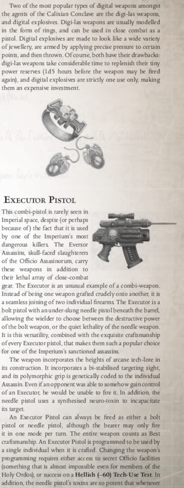
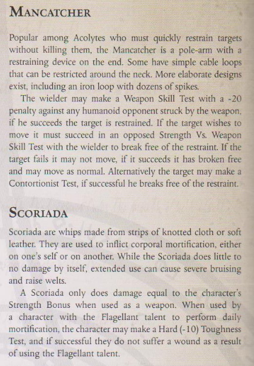

# Wargear

## New Weapon Special Qualities

### Melta
This weapon doubles it pen value at short range.

### Variable Power
Some weapons, such as standard las weapons, have a variable setting option, allowing it to fire higher-powered bursts. A weapon with this quality may be set to overcharge mode, dealing +1 damage, but using two shots worth of ammunition per shot fired. Further, the weapon may be set to overload mode, dealing +2 damage and gaining +2 penetration. In this case, it uses four shots of ammunition per shot fired, loses Reliable, and gains Unreliable.

## Astartes Wargear

### Chain Axe

### Frost Blade

## Attached Operatives Wargear

### Ranged Weapons
#### Las Weapons
|           Name           |  Class | Range |  RoF  |    Dam   | Pen | Clip |  Rld |               Special              |   Wt  |      Req     |     Renown    |
| ------------------------ | ------ | ----- | ----- | -------- | --- | ---- | ---- | ---------------------------------- | ----- | ------------ | ------------- |
| Laspistol                | Pistol |   30m | S/-/- |  1d10+2E |   0 |   30 | Full |           Variable Power, Reliable | 1.5kg |       2      |       -       |
| Lasgun                   |  Basic |  100m | S/3/- |  1d10+3X |   0 |   60 | Full |           Variable Power, Reliable |   4kg |       3      |       -       |
| Las Carbine              |  Basic |   60m | S/2/- |  1d10+2E |   0 |   40 | Full |           Variable Power, Reliable |  3kg  |       3      |       -       |
| Long Las                 |  Basic |  150m | S/-/- |  1d10+3X |   1 |   40 | Full | Variable Power, Accurate, Reliable | 4.5kg |       5      |       -       |
| Man Portable Lascannon   |  Heavy |  300m | S/-/- | 5d10+10E |  10 |    5 | Full |                                    |  55kg |      20      | Distinguished |
| Multi-laser              |  Heavy |  150m | -/-/5 | 2d10+10X |   2 |  100 | Full |                           Reliable |  35kg |      20.     |     Respected |

#### Solid Projectile Weapons
|           Name           |  Class | Range |   RoF  |    Dam   | Pen | Clip |   Rld |       Special      |   Wt  |      Req     |     Renown    |
| ------------------------ | ------ | ----- | ------ | -------- | --- | ---- | ----- | ------------------ | ----- | ------------ | ------------- |
| Autopistol               | Pistol |   30m |  S/-/6 |  1d10+2I |   0 |   18 |  Full |                    | 2.5kg |       2      |       -       |
| Stub Revolver            | Pistol |   30m |  S/-/- |  1d10+3I |   0 |    6 | 2Full |           Reliable |  1kg  |       1      |       -       |
| Stub Automatic           | Pistol |   30m |  S/3/- |  1d10+3I |   0 |    9 |  Full |                    | 1.5kg |       1      |       -       |
| Hand Cannon              | Pistol |   35m |  S/-/- |  1d10+4I |   2 |    5 | 2Full |          See Notes |   5kg |       2      |       -       |
| Autogun                  |  Basic |   90m | S/3/10 |  1d10+3I |   0 |   30 | 2Full |                    | 3.5kg |       3      |       -       |
| Sniper Rifle             |  Basic |  200m |  S/-/- |  1d10+4I |   3 |   20 |  Full | Accurate, Reliable |   5kg |       5      |       -       |
| Shotgun                  |  Basic |   30m |  S/-/- |  1d10+4I |   0 |    2 | 2Full |  Scatter, Reliable |   5kg |       2      |       -       |
| Pump-Action Shotgun      |  Basic |   30m |  S/-/- |  1d10+4I |   0 |    8 | 2Full |            Scatter |   5kg |       2      |       -       |
| Combat Shotgun           |  Basic |   30m |  S/3/- |  1d10+4I |   0 |   18 |  Full |            Scatter | 6.5kg |       3      |       -       |
| Heavy Stubber            |  Heavy |  120m | -/-/10 |  1d10+4I |   3 |  200 | 2Full |                    |  35kg |       6      |       -       |
| Autocannon               |  Heavy |  300m | S/3/- |   3d10+8I |   6 |   20 | 2Full |           Reliable |  40kg |      20      | Distinguished |

##### Hand Cannon
A variant of the stub revolver, the huge hand cannon fires enormous rounds designed to not only take down a target but make a loud and intimidating noise when
doing so. These weapons produce ferocious recoil, and unless fired two-handed, impose a –10 penalty to Ballistic Skill Tests.

#### Bolt Weapons
|            Name           |  Class | Range |  RoF  |    Dam   | Pen | Clip |  Rld  |          Special         |   Wt  |      Req     |     Renown    |
| ------------------------- | ------ | ----- | ----- | -------- | --- | ---- | ----- | ------------------------ | ----- | ------------ | ------------- |
| Bolt pistol               | Pistol |   30m | S/2/- |  1d10+4X |   4 |    8 |  Full |                  Tearing | 3.5kg |       4      |        -      |
| Boltgun                   |  Basic |   90m | S/2/- |  1d10+4X |   4 |   24 |  Full |                  Tearing |   7kg |       4      |        -      |
| Heavy Bolter              |  Heavy |  120m | -/-/8 |  1d10+8X |   5 |   60 | 2Full |                  Tearing |  40kg |      20.     |     Respected |
| Godwyn-De'az Bolt Pistol  | Pistol |  30m  | S/2/- |  1d10+5X |   4 |   10 |  Full |        Tearing, Reliable |   3kg |       4      |     Respected |
| Godwyn-De'az Bolter       |  Basic |   90m | S/2/- |  1d10+5X |   4 |   30 |  Full |        Tearing, Reliable |   6kg |       4      |     Respected |
| Godwyn-De'az Storm Bolter |  Heavy |   90m | S/2/4 |  1d10+5E |   4 |   60 |  Full | Tearing, Reliable, Storm |  12kg |       8      |     Respected |

#### Melta Weapons
|            Name           |  Class | Range |  RoF  |    Dam   | Pen | Clip |  Rld  |          Special         |   Wt  |      Req     |     Renown    |
| ------------------------- | ------ | ----- | ----- | -------- | --- | ---- | ----- | ------------------------ | ----- | ------------ | ------------- |
| Inferno Pistol            | Pistol |   10m | S/-/- |  2d10+6E |  12 |   3  |  Full |                    Melta | 2.5kg |      25      |        Famed  |
| Meltagun                  |  Basic |   20m | S/-/- |  2d10+6E |  12 |   5  | 2Full |                    Melta |   8kg |      18      |     Respected |
| Multi-Melta               |  Heavy |   60m | S/-/- | 2d10+14E |  12 |  12  | 2Full |          Blast(1), Melta |  40kg |      25      |     Respected |
| Seraphim Inferno Pistol   | Pistol |   10m | S/-/- |  2d10+2E |  10 |   6  |  Full |         Melta, Reliable  |   2kg |      25      | Dintinguished |

#### Flame Weapons
|            Name           |  Class | Range |  RoF  |    Dam   | Pen | Clip |  Rld  |          Special         |   Wt  |      Req     |     Renown    |
| ------------------------- | ------ | ----- | ----- | -------- | --- | ---- | ----- | ------------------------ | ----- | ------------ | ------------- |
| Hand Flamer               | Pistol |   10m | S/-/- |  1d10+4E |   2 |   2  | 2Full |                   Flame  | 3.5kg |       5      |       -       |
| Heavy Flamer              |  Basic |   20m | S/-/- |  1d10+4E |   3 |   3  | 2Full |                   Flame  |   6kg |      11      |       -       |
| Seraphim Hand Flamer      | Pistol |   10m | S/-/- |  1d10+4E |   2 |   6  |  Full |                   Flame  |   2kg |      10      |     Respected |
| Heavy Flamer              |  Heavy |   30m | S/-/- |  2d10+4E |   4 |  10  | 2Full |                   Flame  |  45kg |      12      |       -       |

#### Plasma Weapons
|            Name           |  Class | Range |  RoF  |    Dam   | Pen | Clip |  Rld  |          Special         |   Wt  |      Req     |     Renown    |
| ------------------------- | ------ | ----- | ----- | -------- | --- | ---- | ----- | ------------------------ | ----- | ------------ | ------------- |
| Plasma Pistol             | Pistol |   10m | S/-/- |  1d10+6E |   6 |  10  | 3Full |                Volotile  |   4kg |       8      |     Respected |
| Plasma Gun                |  Basic |   90m | S/2/- |  1d10+6E |   6 |  20  | 4Full |                Volotile  |  11kg |      10      |     Respected |
| Plasma Cannon             |  Heavy |  120m | S/-/- | 2d10+10E |   8 |  16  | 5Full |                Volotile  |  40kg |      20      | Distinguished |

#### Traditional Weapons
|            Name           |  Class | Range |  RoF  |    Dam   | Pen | Clip |  Rld  |               Special            |   Wt  |      Req     |     Renown    |
| ------------------------- | ------ | ----- | ----- | -------- | --- | ---- | ----- | -------------------------------- | ----- | ------------ | ------------- |
| Bolas                     | Thrown |   10m | S/-/- |     -    |   0 |   1  |   -   |     Primitive, Snare, Inacurate  | 1.5kg |       2      |       -       |
| Hand Bow                  | Pistol |   15m | S/-/- |    1d10R |   0 |   1  |  Full |                       Primitive  |   1kg |       1      |       -       |
| Flintlock Pistol          | Pistol |   15m | S/-/- |  1d10+2I |   0 |   1  | 3Full | Primitive, Unreliable, Inacurate |   4kg |       1      |       -       |
| Musket                    |  Basic |   30m | S/-/- |  1d10+2I |   0 |   1  | 5Full | Primitive, Unreliable, Inacurate |   7kg |       2      |       -       |
| Bow                       |  Basic |   30m | S/-/- |    1d10R |   0 |   1  |  Full |              Primitive, Reliable |   2kg |       2      |       -       |
| Sling                     |  Basic |   15m | S/-/- |  1d10-2I |   0 |   1  |  Full |                        Primitive | 0.5kg |       1      |       -       |
| Crossbow                  |  Basic |   30m | S/-/- |    1d10R |   0 |   1  | 2Full |                        Primitive |   3kg |       2      |       -       |

#### Launchers
|            Name           |  Class | Range |  RoF  |    Dam   | Pen | Clip |  Rld  |               Special            |   Wt  |      Req     |     Renown    |
| ------------------------- | ------ | ----- | ----- | -------- | --- | ---- | ----- | -------------------------------- | ----- | ------------ | ------------- |
| Grenade Launcher          |  Basic |   60m | S/-/- |     *    |   * |   6  |  Full |                          *       |   9kg |       5      |       -       |
| RPG Launcher              |  Heavy |  120m | S/-/- |     *    |   * |   1  |  Full |                          *       |  15kg |       6      |       -       |
| Missile Launcher          |  Heavy |  300m | S/-/- |     *    |   * |   1  |  Full |                          *       |  35kg |      10      |       -       |

*Damage, Armour Piercing and Special Qualities are determined by the ammunition (i.e. the grenade, for grenade launcher and rpg, missile for missile launcher) fired.

#### Grenades and Missiles
|            Name           |  Class | Range |  RoF  |    Dam   | Pen |        Special      |   Wt  | Req |     Renown    |
| ------------------------- | ------ | ----- | ----- | -------- | --- | ------------------- | ----- | --- | ------------- |
| Frag Grenade              | Thrown |  SBx3 | s/-/- |    2D10X |   0 |            Blast(4) |   0.5 |  1  |       _       |
| Krak Grenade              | Thrown |  SBx3 | s/-/- |  2D10+4X |   6 |                     |   0.5 |  1  |       _       |
| Blind Grenade             | Thrown |  SBx3 | s/-/- |     -    |   0 |               Smoke |   0.5 |  3  |       _       |
| Photon Flash Grenade      | Thrown |  SBx3 | s/-/- |     -    |   0 |           See Notes |   0.5 |  3  |       _       |
| Hallucinogen Grenade      | Thrown |  SBx3 | s/-/- |    2D10X |   0 |  See Notes, Blast() |   0.5 |  5  |     Respected |
| Fire Bomb                 | Thrown |  SBx3 | s/-/- |  1D10+3X |   6 | See Notes, Blast(3) |   0.5 |  3  |       _       |

#### Photon Flash Grenade
Photon ash grenades detonate like a small star, blinding anyone nearby and bright enough to overload cheap or primitive vision protection systems. Anyone within 15 metres of a photo ash grenade when it detonates must succeed on a Toughness Test or be blinded for 1d5 Rounds.

#### Hallucinogen Grenade
These kinds of grenades induce a variety of short-lived psychological states and delusions. Anyone within 10 metres of a detonating hallucinogen grenade must succeed on a Difficult (–10) Toughness Test or be overcome with delusions and hallucinations for 1d10 Rounds. Whilst affected, on the character’s Turn, roll d100. On a 50 or less, the character may act normally. On a 51–75, the character runs around screaming in response to someperceived weirdness. On a 76 or higher, the character attacks the closest creature to him, regardless of friend or foe, using whatever weapons he has.  
**Optional Rule**: When the character is first affected by a hallucination grenade, you can roll on  the bellow table: *Hallucinogen Effects*, to see how the character behaves for the next 1d10 Rounds.  

#### Firebomb
A relatively primitive grenade, the fire bomb is normally a breakable canister of ammable liquid with a fuse made from cloth or other material that the liquid can soak into. Once the fuse is set a ame, the bomb is hurled at the enemy; the canister breaks open on impact to release the now burning liquid. A target struck by a fire bomb must make an Agility Test or catch on fire

#### Exotic Weapons
|            Name           |  Class | Range |  RoF  |    Dam   | Pen | Clip |  Rld  |         Special      |   Wt  |   Req  |     Renown    |
| ------------------------- | ------ | ----- | ----- | -------- | --- | ---- | ----- | -------------------- | ----- | ------ | ------------- |
| Needle Pistol             | Pistol |   30m | S/–/– |    1d10R |  0  |   6  |  Full |      Accurate, Toxic | 1.5kg |      5 |     Respected |
| Web Pistol                | Pistol |   30m | S/–/– |     -    |  0  |   6  |  Full |                Snare | 3.5kg |      5 | Distinguished |
| Needle Rifle              |  Basic |  180m | S/–/– |    1d10R |  0  |   6  |  Full |      Accurate, Toxic |   2kg |      8 | Distinguished |
| Webber                    |  Basic |   50m | S/–/– |     -    |  0  |   6  |  Full |      Blast(5), Snare |   8kg |      8 |         Famed |

### Melee Weapons

## Armour
|           Name           |  Locations Cvered |       AP      |   Wt |      Req     |     Renown    |
| ------------------------ | ----------------- | ------------- | ---- | ------------ | ------------- |
| Sororitas Powered Armour |          All      | 7 (8 on Body) | 35kg |      N/A     |       -       |

Commissionsed by Gog Vandire, it is the only part of his legacy that was not removed with his head. Created initially by the forges on Mars for the Adepta Sororitas, this lighter power armour provides excelent protection and increased strength with little to no reduction to movement speed or agility. The armour uses a simular power supply as the armourt of the Adeptus Astartes and does not run out of power unless damaged.  
Sororitas Power armour adds +10 to the user's strength and the helmet includes an integrated targeter (+5 to BS), a rebreather (1 hour of oxygin supply), a com link and 4 doses of pain suppressor. The armour is environmentally sealed for limited us in void combat. Users with a heavy weapon treat it as braced.

### Special Amunition

### Tools

