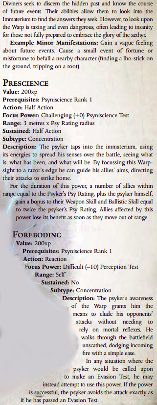

# Attached Operatives Psychic Powers
Follows are the rules for attacked operatives with a Psy-rating. In general Attached operative powers are weaker, but cheeper than those of the librarium. They are also more numerous, allowing operatives to be more flexable.  
Operatives gain and use their powers in the exact same manner as space marine librarians.

## Psychic Powers

### Biomancy

### Divination

### Pyromancy

### Telekinesis

### Telaphathy

## Ascended Psychic Powers
Here's where I pull in all the assention psychic powers to make the insane Primaris Psycher from Ascension!
