# Attached Operative Talents

### Deathwatch Indoctrination
Be it through indoctrination, training, or the pure amount of time you have spent fighting alongside astartse of the Deathwatch, you can on occasion benefit from their squad tactics. You can enter squad mode just like an astartes. Any codex squad mode initiated by the squad leader can be used by your operative if the squad leader succeeds on a challenging (+0) `Command` test.
While in squad mode you my not use any specialised usage of fate points given to you by your organisation or speciality. You also my not use faith powers. Your character is so in tune with thune with the movements of the gods of death that they are fighting with that it is imposible to focus on their more complex abilities.

### Terrifying Truths
You can use `Fel` instead of `S` for intimidation tests.

### Unremarkable 
You have a forgettable face and are able to blend in with a crowd. Attempts to notice you when amongst other people or anyone attempting to describe you or recall details about you incurs a –20 penalty.

### Untouchable
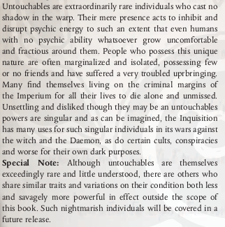
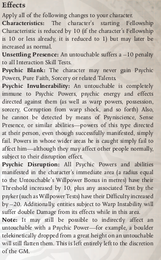
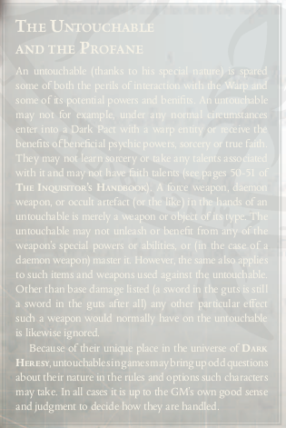 
Having lived with this condition for any period of time, you learn to adapt your deceptions to suit. You may now use `Int` for `Deceive` tests instead of `Fel`

## Faith Powers
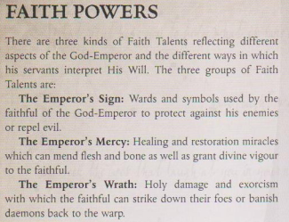

### Pure Faith

### Emperor's Sign
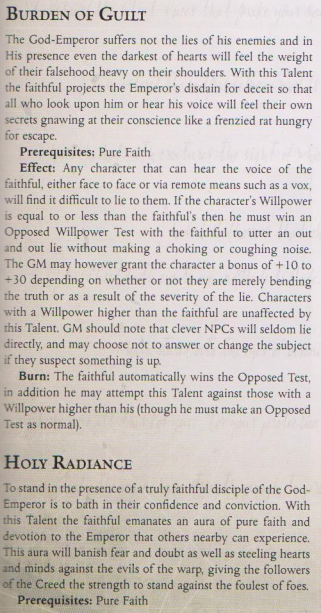
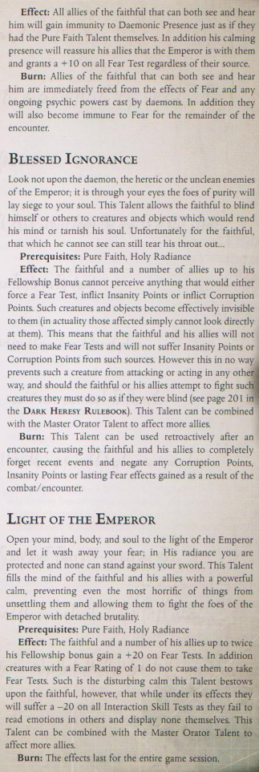
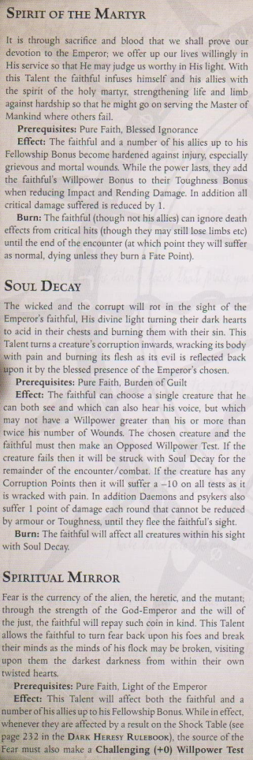
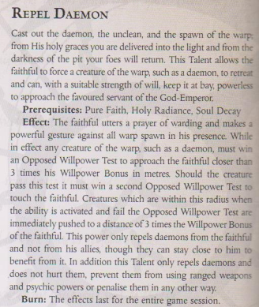
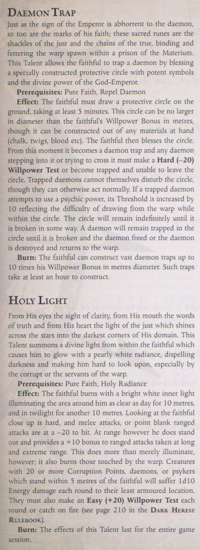
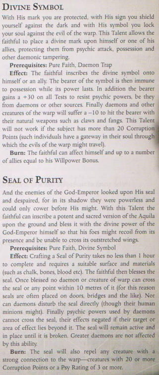

### Emperor's Mercy
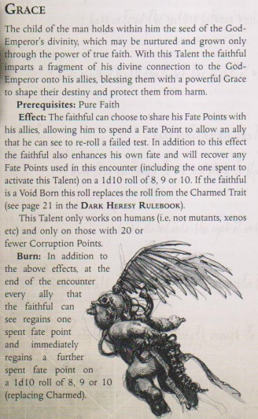
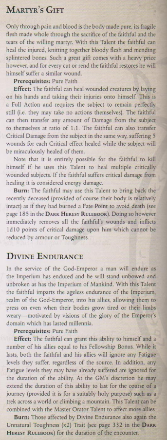
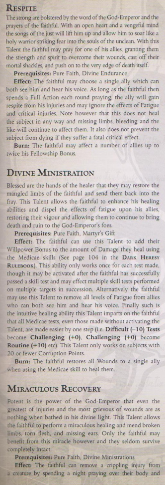
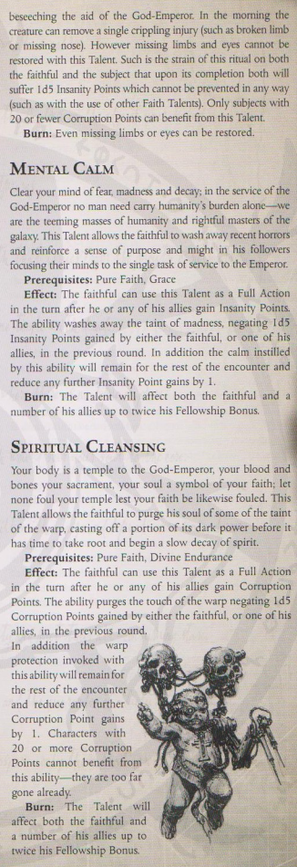

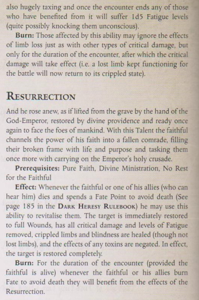

### Emperor's Wrath
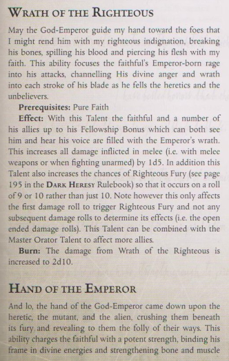
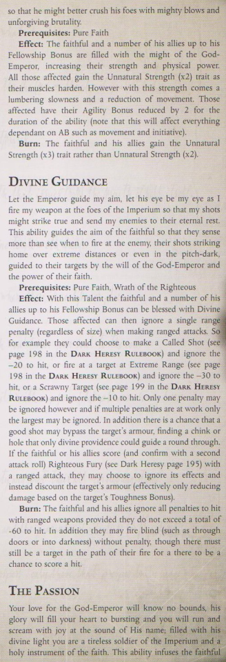
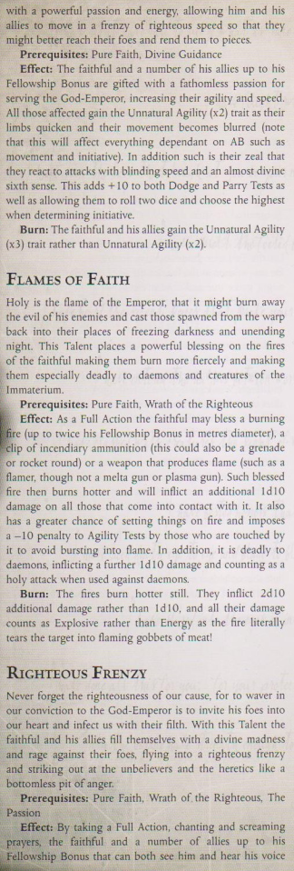
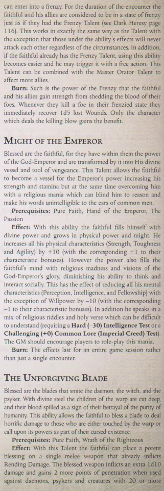
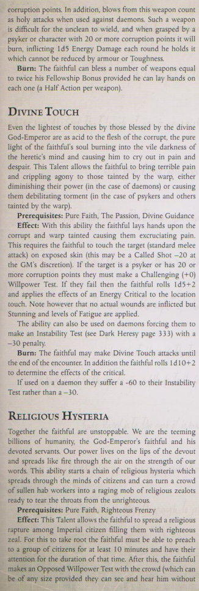
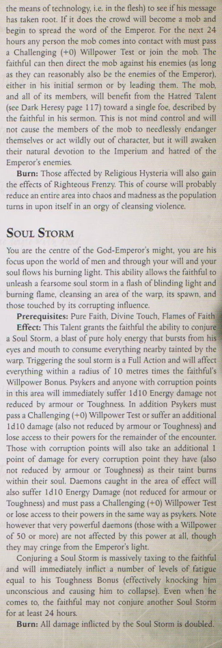
