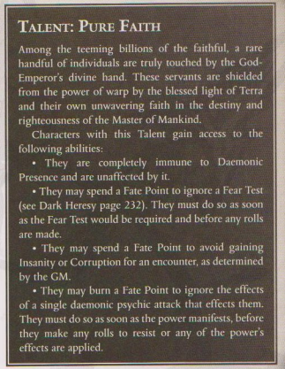
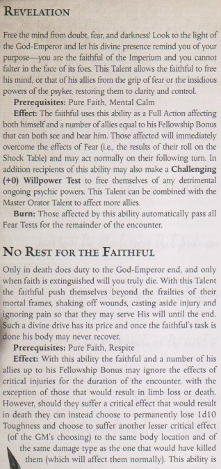

# Attached Operative Talents

### Deathwatch Indoctrination

### Terrifying Truths
You can use `Fel` instead of `S` for intimidation tests.

### Unremarkable  
You have a forgettable face and are able to blend in with a crowd. Attempts to notice you when amongst other people or anyone attempting to describe you or recall details about you incurs a –20 penalty

### Untouchable

    
Some aditional rules to make all the skills work properly

## Faith Powers

### Pure Faith

### Emperor's Sign

### Emperor's Mercy

### Emperor's Wrath

